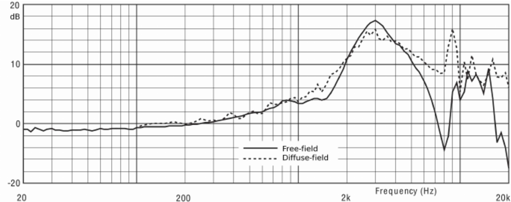
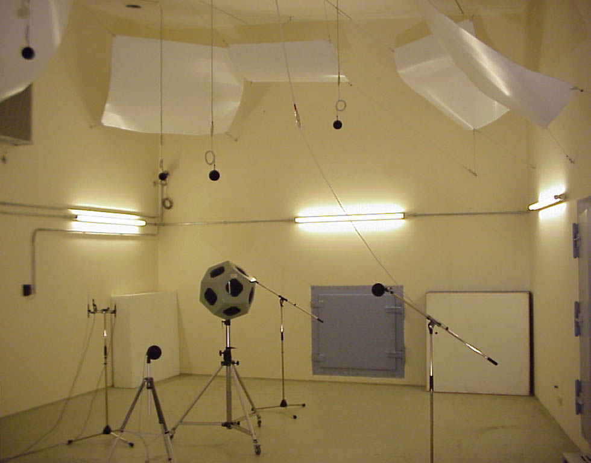
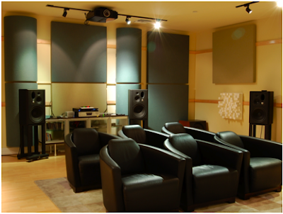

+++
title="[声学]声音的还原，从历史的角度了解哈曼曲线和目标曲线的意义"
tags=["声学"]
categories=[声学"]
date=""
toc=true
+++

## 前言

本文主要翻译，摘自：

https://www.reddit.com/r/headphones/comments/eetyx9/what_does_harman_and_diffuse_field_equalization/

https://www.reddit.com/r/oratory1990/

在论坛上oratory1990聊了不少声学，eq方面的话题。本文章主要是翻译和总结oratory1990的帖子，加上我自身的一些看法。

对于业余的发烧友来说，通过了解到当年不同的目标曲线如何得出，就能明白为何作为回放设备的耳机需要追求频响曲线，为什么会存在目标曲线，以及帮助我们该如何选择耳机，在保证还原性能之外可以做出什么样的取舍。

## 1.音箱的回放性能和耳机该听起来这么样

一个理想的音箱因该听起来怎么？现在我们听到的音乐，在音乐制作阶段，音乐制作人的耳朵里面听起来是怎么样的？

在消声室当中的频响曲线是纯平的。

在这样的前提下，音乐制作人调节各个音轨的音量平衡，决定各个声部的搭配。

但是当理想的音箱到了使用的阶段，例如混音室，工作室，监听室等等的环境之下，频响会因为环境的反射出现频响的变化。例如在一个“普通”的房间，这个房间会产生轻微的反射，测试结果来

看，低频会有大概4db的增益，高频会有-2db的损失，都是超过人类阈值可闻的变化。即使是纯平的理想音箱，在不同的声学装修下，最后在人耳中会产生一定量的变化。

因此会回到一个问题，如果耳机作为回放设备理想的情况下是还原音乐制作所听到的声音，那么该如何设置目标的曲线？如何测量，测量环境如何设置，测试设备能否覆盖大部分人的参数，等等的问题出现在实验当中。

正因为这是个非常复杂的问题，所以哈曼曲线每过几年都会进行更新，其目的在于更近一步的推进声音的还原。

## 2.历史上的实验

在历史上，70，80年代ITU，The International Telecommunication Union，推荐过一种自由场曲线。通过在消声室之中，在人头麦的正前方放了一个音箱，并且测量人头麦所听到的频响曲线。

蓝线就是当时测出来的结果，在3kHz的部分有接近15db的增益，5k部分则有巨大的下折，则导致了在当时的耳机制造厂商来说基本上难以做出这样曲线的耳机，世界上以此为目标曲线的耳机也非常少见。用现在的常识来看，这样的频响曲线很难说有什么还原。

同时也有另外一种实验方法，扩散场曲线

在一个极强的反射室之中，配置许多的音箱，保证所有的声音从所有的角度到达在人头麦时间是一样的。

实验方法大概是下面这样，更新的实验是用的是大名顶顶的ku100人头麦。

为什么这样设置？因为实验设计者认为，头戴耳机是覆盖则人耳，头戴耳机的声音到达耳朵的形式跟这个实验是类似的。

测试的结果是红线，相比蓝线正常多了，在实际听感上保持相对平衡，但是高频的峰使得听起来更加“亮”

AKG 240DF, Beyerdynamic DT880, Etymotic Research ER4-series 等等的耳机都是以此为目标。

在实际的听感来说，会感觉“声场”更大，两侧更远，但是还原性来说并不理想，过亮的高频会听起来很容易疲劳。反而有某些厂家通过这个技巧让耳机“声场”更大

但是这两个实验，一般人都能挑出不少问题，从现在的眼光来看其实并不理想，可在当时的年代来说是非常有意义的实验，为了更好的还原声音，下一步会是什么？

## 3.Sean Olive登场！

说到现代声学无论如何都绕不开这个人的名字，Sean Olive认为无论如何是自由场曲线，还是扩散场曲线在还原性上都是有问题的，至少不理想。实际上只要各位利用autoeq去试下，两者的声音跟音箱相比区别用不着测试都能说出有问题。

Sean Olive认为有更好的测试方法，他认为测试环境本身应当接近音乐制作所使用的房间，应当接近监听室，混音室，录音室，而不该在消声室或者反射室去进行实验。

这就是Harman's reference room，反射时间在0.4秒，非常接近于0.3秒反射时间的专业录音室。

相比自由场曲线跟扩散场曲线，由于房间的反射，会有多一点的低频，但是高频也会因为房间会有少许衰减。

在这样的环境下，使用更加先进的人头麦，最后得出的就是哈曼曲线的雏形

在后续的实验中，证明了这个实验方法得出的目标曲线是有效的。

详见：

Listener Preferences for Different Headphone Target Response Curves

http://www.aes.org/e-lib/browse.cfm?elib=16768

在不同目标曲线，和原版的声音的双盲实验中，对于这样实验设置得出的目标曲线评价最高。

## 4.总结

出于人耳的阈值，感知性限制等等的客观因素

没有bassboost的哈曼曲线，无论是主观上还是客观上都非常接近于音乐制作人制作时的声音了。

至于为什么有这么多版的哈曼曲线，跟为什么会有bassboost....

前者我个人的理解是因为实验设备，测量方法是在不断前进的，每隔几年来个更多更精确的目标也没啥问题。

bassboost这个问，虽然是在统计上体现的偏好性。我个人在想是不是跟近年的 响度战争 和 听力损害有关，对于低音，动词打次的喜好近年确实有所增加。从消费者市场来说，提供给客户更多低音的耳机也许会更好卖吧，即使这不Hifi。

那么在耳机选择上有什么指导意义？因为eq并不是万能，过高的增益会导致失真问题。

选择原本频响曲线接近没有bassboost的哈曼曲线的耳机，在声音的还原上就更方便。

hd600，hd560s这类型的耳机基本上都逃不开的，性价比也非常的高，特别是加上eq和声场模拟算法。

而且更贵的耳机会遇到一个问题，有这个钱为什么不去买表现更加好的音箱，无论是还原性还是真正的声场表现都不是耳机能给予的。

我并不否认一部分更贵的耳机，在结构上能带来更好的听感，也有些会有更美妙的音色。但是我认为经过校准之后的耳机才能发挥这个耳机真正实力。

最后说说今后的选择，我认为能带来更好听感的解决方法只有计算音频，现在可以看到水月雨已经开始做声场还原了，苹果也在做动态频响。

我希望今后的某天，能买到一个外壳可拆卸的降噪无线耳机，还带typec接电脑。同时可以通过app进行单耳扫频测试，将数据烧入耳机之中。还可以支持杜比全景声跟正三十度音箱声场还原，可调节的动态频响。反正也贵不过那些“高端“hufi耳机，希望这个梦在几年内实现吧。